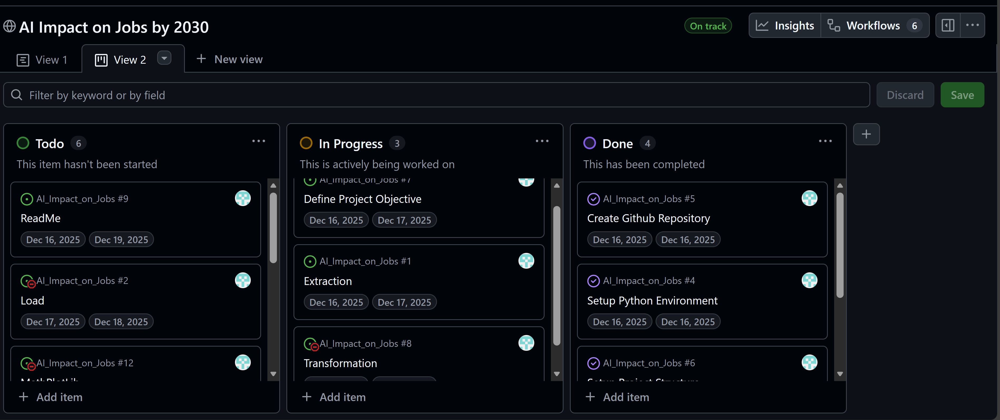

# 

# AI Impact on Jobs by 2030

Artificial Intelligence is no longer a distant idea. It is already changing how work is done, which skills are important, and which jobs are most at risk of automation. With news reports frequently talking about job lay-offs, some are caused by economic problems, while others are linked to the growing use of AI and automation. This project explores these changes using the AI Impact on Jobs 2030 dataset.

The aim of this analysis is not to predict exactly how many jobs will be lost or created. Instead, it focuses on understanding patterns in AI exposure, automation risk, and how job skills may change across different occupations. By using realistic job roles, salaries, skill levels, and automation probabilities, this dataset helps us explore important questions about the future of work in a safe and ethical way.

## Project Aim 
To find out how AI might affect jobs by 2030. We want to see which jobs are most at risk, which skills and education can protect jobs, and give clear information to help people and businesses plan for the future.

## Dataset Content
I’m using the AI Impact on Jobs dataset from Kaggle. It includes different jobs, the skills and education they require, and how likely they are to be automated by 2030. The dataset combines information from sources like O*NET, McKinsey, the World Economic Forum, and LinkedIn/Glassdoor, with all numbers simulated to make the data realistic. Jobs are grouped into High, Medium, or Low automation risk, and skill levels are shown across ten areas. Using this dataset helps me explore which jobs might be most affected by automation and why. It is safe to use because it contains no personal data and complies with data privacy regulations.

Snippit of the Dataset: [View Here](output.html)

## Project Requirements
1. Clean and Transform Data:
Prepare the raw dataset by handling missing values, standardising formats, and structuring it for analysis and visualisation.
2. Classify Job Risk Levels:
Identify high-, medium-, and low-risk jobs for AI-driven automation based on risk scores.
3. Analyse Relationships:
Explore how education levels and skills affect automation risk to understand why some jobs are safer while others are more vulnerable.
4. Visualise Insights:
Build clear visual summaries (charts, graphs, dashboards) to highlight key findings for decision-making.
5. Ensure Compliance:
Make sure all data is handled responsibly. The dataset does not contain any personal or sensitive information, so it follows data rules and is safe to use.

## Hypothesis and how to validate?

### Hypothesis 1
Entry-level or graduate jobs, which often involve routine or manual tasks, are at higher risk of AI-driven automation by 2030.

To validate this hypothesis:

1. Dataset will be examined to see the automation risk scores for entry-level and graduate jobs.
2. Jobs seperated into routine/manual versus cognitive/creative roles within entry-level and graduate positions, and compare their risk levels.
3. Visualise Patterns using bar charts, heatmaps, or scatter plots to show differences in automation risk across these job types and support the hypothesis.

### Hypothesis 2

Jobs that require higher education are less likely to be automated.

To validate this hypothesis:

1. Jobs will be organised by education level.
2. Calculate Average Risk: Find the average automation risk for each education group.
3. Visualise Correlation to show how higher education relates to lower risk.

### Hypothesis 3

Jobs that need advanced digital or thinking skills (like creativity, communication, or technical skills) are safer from AI automation.

To validate this hypothesis:

1. Will identify skill scores for each job in the dataset.
2. Compare skills and risk calculating the correlations between skills and automation risk.
3. Visualise Trends to show which skills reduce automation risk.

## Project Plan
### Planning 
* Enviroment Setup 
* Project Kanban Board Setup 

### Data Preparation (ETL)

* Extract: Get the raw data from Kaggle and load into IDE (VSCode).
* Transform: Clean, standardise, normalise the data so it is ready for analysis.
* Load: Save the cleaned and structured dataset in a table format for analysis and visualisation seprerate from the raw dataset. 

### Analysis

* Analyse the cleaned dataset based of the 3 hypothesis points using Panda for data analysis. 

### Visualisation

* Visulaise the data analysis using python libraries ploty, Seaborn and Mathplotlib. 

$\color{red}{\text{To be continued}}$
* Outline the high-level steps taken for the analysis.
* How was the data managed throughout the collection, processing, analysis and interpretation steps?
* Why did you choose the research methodologies you used?

## The rationale to map the business requirements to the Data Visualisations
* List your business requirements and a rationale to map them to the Data Visualisations

## Analysis techniques used
* List the data analysis methods used and explain limitations or alternative approaches.
* How did you structure the data analysis techniques. Justify your response.
* Did the data limit you, and did you use an alternative approach to meet these challenges?
* How did you use generative AI tools to help with ideation, design thinking and code optimisation?

## Ethical considerations
* Were there any data privacy, bias or fairness issues with the data?
* How did you overcome any legal or societal issues?

## Unfixed Bugs
* Please mention unfixed bugs and why they were not fixed. This section should include shortcomings of the frameworks or technologies used. Although time can be a significant variable to consider, paucity of time and difficulty understanding implementation are not valid reasons to leave bugs unfixed.
* Did you recognise gaps in your knowledge, and how did you address them?
* If applicable, include evidence of feedback received (from peers or instructors) and how it improved your approach or understanding.

## Development Roadmap
* What challenges did you face, and what strategies were used to overcome these challenges?
* What new skills or tools do you plan to learn next based on your project experience? 

## Main Data Analysis Libraries
* Here you should list the libraries you used in the project and provide an example(s) of how you used these libraries.

## Credits 

* In this section, you need to reference where you got your content, media and extra help from. It is common practice to use code from other repositories and tutorials, however, it is important to be very specific about these sources to avoid plagiarism. 
* You can break the credits section up into Content and Media, depending on what you have included in your project. 

### Content 

- The text for the Home page was taken from Wikipedia Article A
- Instructions on how to implement form validation on the Sign-Up page was taken from [Specific YouTube Tutorial](https://www.youtube.com/)
- The icons in the footer were taken from [Font Awesome](https://fontawesome.com/)

### Media

- The photos used on the home and sign-up page are from This Open-Source site
- The images used for the gallery page were taken from this other open-source site

## Acknowledgements (optional)
* Thank the people who provided support through this project.