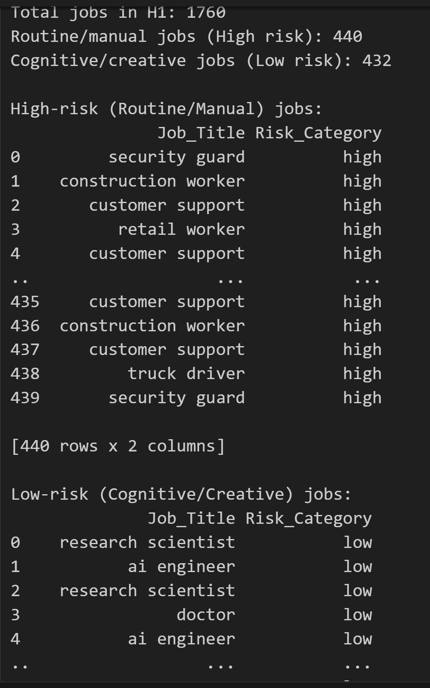
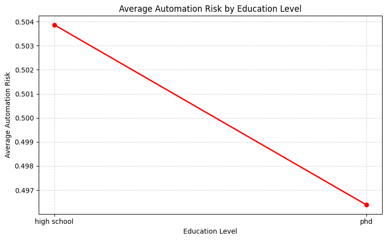
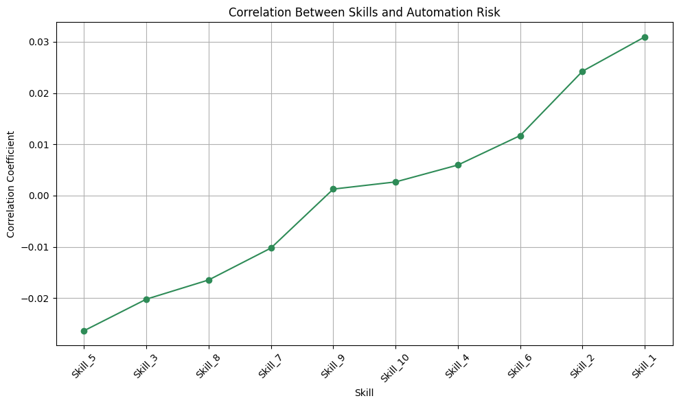

# 

# AI Impact on Jobs by 2030

Artificial Intelligence is no longer a distant idea. It is already changing how work is done, which skills are important, and which jobs are most at risk of automation. With news reports frequently talking about job lay-offs, some are caused by economic problems, while others are linked to the growing use of AI and automation. This project explores these changes using the AI Impact on Jobs 2030 dataset.

The aim of this analysis is not to predict exactly how many jobs will be lost or created. Instead, it focuses on understanding patterns in AI exposure, automation risk, and how job skills may change across different occupations. By using realistic job roles, salaries, skill levels, and automation probabilities, this dataset helps us explore important questions about the future of work in a safe and ethical way.

## Project Aim 
To find out how AI might affect jobs by 2030. We want to see which jobs are most at risk, which skills and education can protect jobs, and give clear information to help people and businesses plan for the future.

## Dataset Content
I’m using the AI Impact on Jobs dataset from Kaggle. It includes different jobs, the skills and education they require, and how likely they are to be automated by 2030. The dataset combines information from sources like *'O'NET, McKinsey, the World Economic Forum, and LinkedIn/Glassdoor, with all numbers simulated to make the data realistic. Jobs are grouped into High, Medium, or Low automation risk, and skill scores randomized (0–1) to represent ten skill dimensions like creativity, robotics, and communication'* are shown across ten areas. Using this dataset helps me explore which jobs might be most affected by automation and why. It is safe to use because it contains no personal data and complies with data privacy regulations.

Snippit of the Dataset: [View Here](./output.html) 

## Project Requirements
1. Clean and Transform Data:
Prepare the raw dataset by handling missing values, standardising formats, and structuring it for analysis and visualisation.
2. Classify Job Risk Levels:
Identify high-, medium-, and low-risk jobs for AI-driven automation based on risk scores.
3. Analyse Relationships:
Explore how education levels and skills affect automation risk to understand why some jobs are safer while others are more vulnerable.
4. Visualise Insights:
Build clear visual summaries (charts, graphs, dashboards) to highlight key findings for decision-making.
5. Ensure Compliance:
Make sure all data is handled responsibly. The dataset does not contain any personal or sensitive information, so it follows data rules and is safe to use.

## Hypothesis and how to validate?

### Hypothesis 1
Entry-level or graduate jobs, which often involve routine or manual tasks, are at higher risk of AI-driven automation by 2030.

To validate this hypothesis:

1. Dataset will be examined to see the automation risk scores for entry-level and graduate jobs.
2. Jobs seperated into routine/manual versus cognitive/creative roles within entry-level and graduate positions, and compare their risk levels.
3. Visualise Patterns using bar charts, heatmaps, or scatter plots to show differences in automation risk across these job types and support the hypothesis.

### Hypothesis 2

Jobs that require higher education are less likely to be automated.

To validate this hypothesis:

1. Jobs will be organised by education level.
2. Calculate Average Risk: Find the average automation risk for each education group.
3. Visualise Correlation to show how higher education relates to lower risk.

### Hypothesis 3

Jobs that need advanced digital or thinking skills (like creativity, communication, or technical skills) are safer from AI automation.

To validate this hypothesis:

1. Will identify skill scores for each job in the dataset.
2. Compare skills and risk calculating the correlations between skills and automation risk.
3. Visualise Trends to show which skills reduce automation risk.

## Project Plan
#### Planning 
* Enviroment Setup 
* Project Kanban Board Setup 

#### Data Preparation (ETL)

* Extract: Get the raw data from Kaggle and load into IDE (VSCode).
* Transform: Clean, standardise, normalise the data so it is ready for analysis.
* Load: Save the cleaned and structured dataset in a table format for analysis and visualisation seprerate from the raw dataset. 

#### Analysis

* Analyse the cleaned dataset based of the 3 hypothesis points using Panda for data analysis. 

#### Visualisation

* Visualise the data analysis using python libraries ploty, Seaborn and Mathplotlib. 

## The rationale to map the requirements to the Data Visualisations
#### Hypothesis 1 

The results show that entry-level and graduate jobs involving routine or manual tasks have higher automation risk scores than those requiring cognitive or creative skills. This suggests that jobs with repetitive and predictable tasks are more vulnerable to AI-driven automation. In contrast, roles that require problem-solving, creativity, and human interaction show lower automation risk. These findings support Hypothesis 1 and indicate that task type plays an important role in determining automation risk.

#### Hypothesis 2

The results support the hypothesis that jobs requiring higher education are less likely to be automated. As education level increases, the average automation risk decreases. This suggests that higher-skilled and more specialised roles are more resistant to AI-driven automation.

#### Hypothesis 3

#### Drawbacks of the visualization results:

* Synthetic Data Limitations: based on simulated data, not real labor market observations.
* Oversimplification of Complex Subject: Not covering all angles of this subject. 
* Biased Data 

## Analysis techniques used
#### Analysis Methods 
* Correlation Analysis
* Descriptive Statistics
* Categorical Analysis

#### Generative AI Support
* Helped clean, transform the dataset for analysis.
* Suggested appropriate charts and visualizations for different data types.
* Generated Python code for efficient and interactive plotting.

## Ethical considerations
This Kaggele Dataset is *'synthetic, ensuring no personal or identifiable data'* as mentioned on the site. 

## Unfixed Bugs
Under the README file --> Data Context --> Snippit of the Dataset: [View Here](./output.html).

The link does not take the user directly to the HTML page on the web. From what I understand, GitHub treats HTML files as code, so clicking the link opens the HTML source instead of rendering the page. Due to time constraints, I was unable to find a solution for this.

During the Plotly visulaisation I was getting the following error:

**ValueError: Mime type rendering requires nbformat>=4.2.0 but it is not installed**

I tried installing the required package, but it didn’t work. I suspect there might have been an issue with the package installation or a version mismatch. Due to time constraints, I implemented a quick fix by displaying Plotly figures directly in the browser using:

_import plotly.io as pio_

_pio.renderers.default = "browser"_

## Development Roadmap
### Challenges 
1. Installing and configuring the required packages sometimes caused version mismatches or errors.
I read the documentation, tried different installation methods, and used quick fixes, such as displaying Plotly figures directly in the browser to keep the project on track.

2. Ensuring that the data analysis outputs were visualised according to the hypotheses. Some visualisations initially did not make sense.
I adjusted the code as needed, and AI Github CoPilot helped me understand the code gave suggestions on the analysis to create visualisations that accurately supported the hypotheses.

3. Linking HTML outputs in a README so that they display directly in the browser.
I researched GitHub’s behaviour and documented the limitation, with plans to fix it properly later.

### New skills or tools to learn next

* Deeper understanding of package management and virtual environments
* GitHub Pages for hosting HTML outputs
* Advanced visualization techniques
* Interactive web content
* More Practice on Numpy and Pandas

## Main Data Analysis Libraries
* Pandas: Data Analysis
* Numpy: Numerical Operations
* Seaborn: Visualisations
* MathPlotLib: Visualisations
* Plotly: Visualisations

## Credits 

* Github Copilot
* https://www.kaggle.com/datasets/khushikyad001/ai-impact-on-jobs-2030/data

## Acknowledgements (optional)
I would like to express my gratitude to my facilitator and cohorts for support throughout this project.